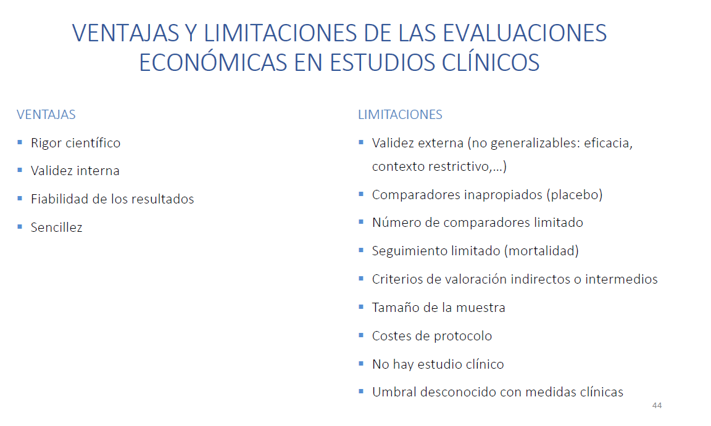
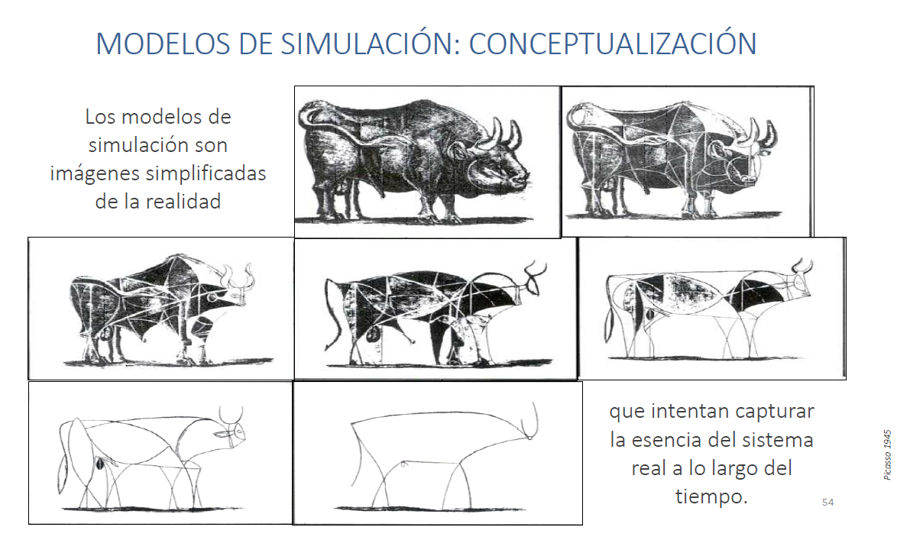
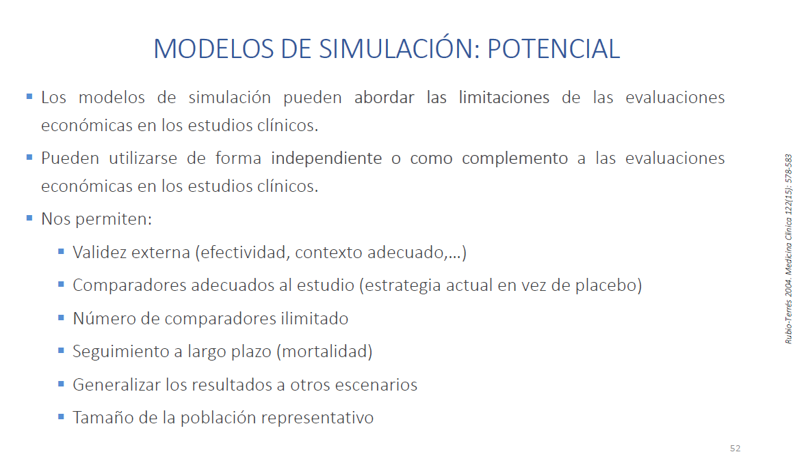
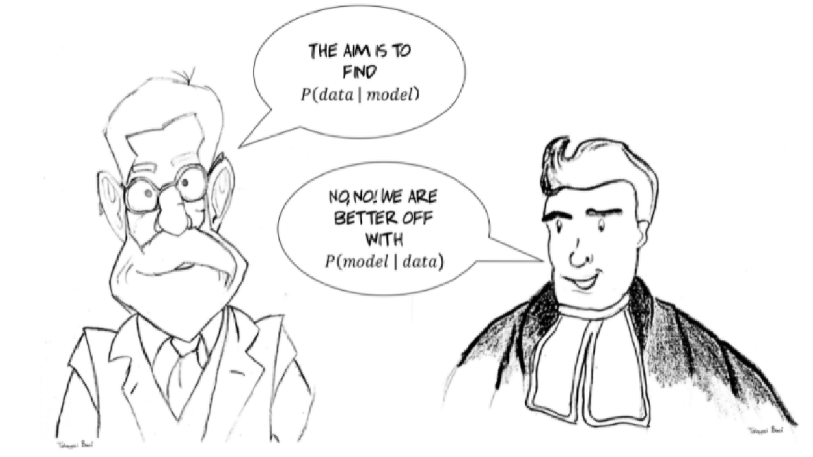
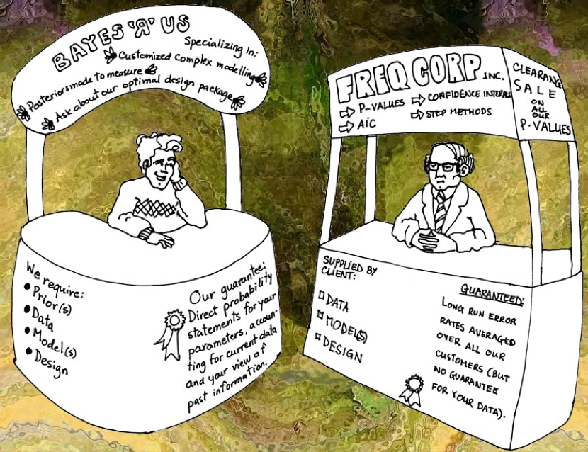
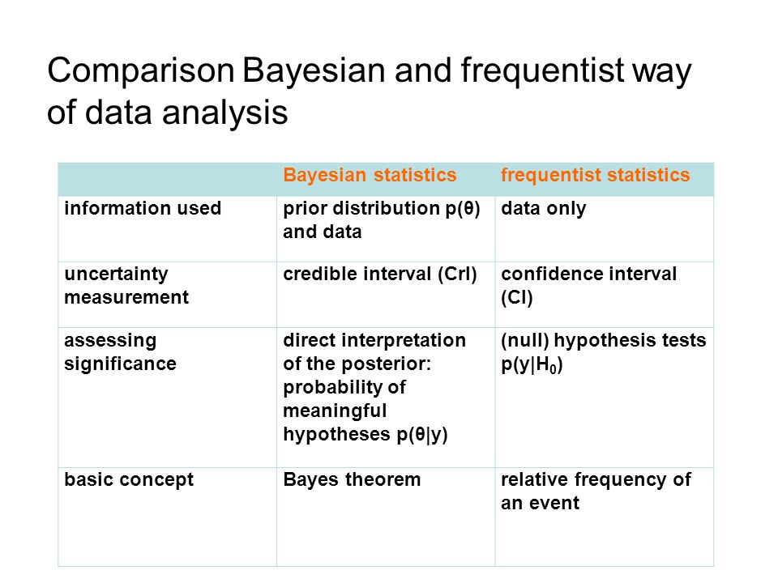
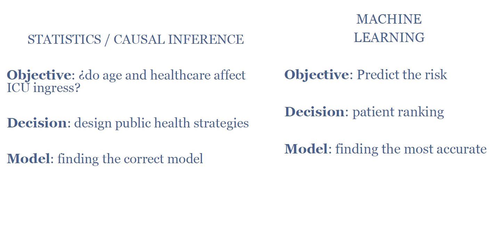
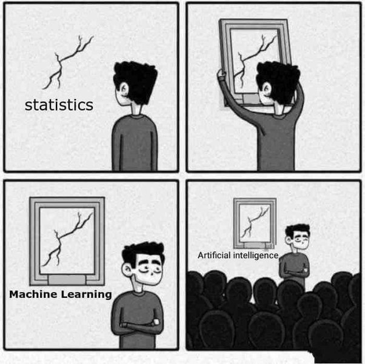
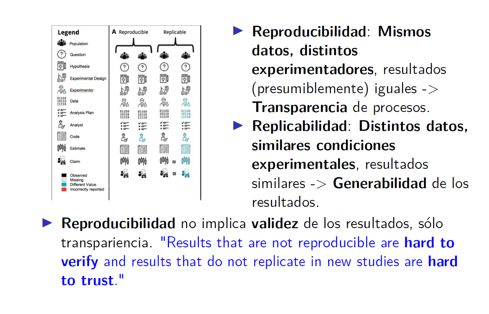
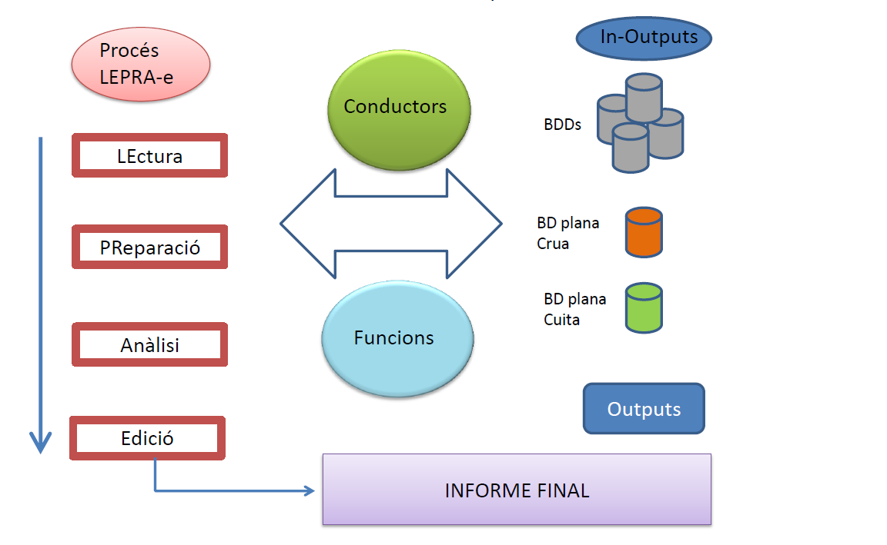

```{r setup, include=FALSE}

options(htmltools.dir.version = FALSE)

library(dplyr)
library(DT)
library(qrcode)


```


---
class: inverse, center, middle

# Sessions d'estadística
https://jrealgatius.github.io/sessioUSR/presentacio.html

```{r, include=T, echo=FALSE, out.width="50%"}

qr<-qrcode::qr_code("https://jrealgatius.github.io/sessioUSR/presentacio.html")

plot(qr)


```


---

# Sessions d'estadística DAP Cat

## De que parlarem?

1. Programa de sessions

  - Lectura de programa
  - On el podeu trobar?
  - Sintesis de cada sessió

--

1. A proposit de la Reproducibilitat

  - Sistema organitzatiu UEMC I+D
  - Análisis conductual
  - R-Markdown
  - Github (Control de versions)

---

# [Sessions d'estadística](https://jrealgatius.github.io/SessionsMetode/Programa.html)

Programa i material de sessions es poden trobar aquí: https://jrealgatius.github.io/SessionsMetode/Programa.html

.pull-left[

1. Estadística y sentido común

1. [Estadística Bayesiana](https://github.com/jrealgatius/SessionsMetode/tree/main/s2)

1. [Reproducibilidad](https://github.com/jrealgatius/SessionsMetode/tree/main/s3)

1. [Replicabilidad](https://github.com/jrealgatius/SessionsMetode/tree/main/s4)

1. [Inferencia causal](https://github.com/jrealgatius/SessionsMetode/tree/main/s5)

1. [Machine Learning](https://github.com/jrealgatius/SessionsMetode/tree/main/s6)

1. [Simulación y Coste-Efectividad](https://github.com/jrealgatius/SessionsMetode/tree/main/s7)

1. [Tratamiento de missings](https://github.com/jrealgatius/SessionsMetode/tree/main/s8)

  
  ]

.pull-right[

- José Miguel Martínez

- Xavi Puig

- Miguel A. Martinez-Beneito

- Miguel A. Martinez-Beneito

- Aleix Ruiz de Villa

- Aleix Ruiz de Villa

- Mireia Diaz

- Guillem Pera


]


---
# [Missings](https://github.com/jrealgatius/SessionsMetode/tree/main/s8)

### Patrons

1. MCAR: P(Tener dato / Dato, X ) = P(Tener el dato)
  - Se pierde una caja con encuestas
  - Se borra accidentalmente un fichero con datos

--

1. MAR: P(Tener dato / Dato, X ) = P(Tener el dato / X)
  - Los hombres recuerdan peor cuando vacunaron a sus hijos
  - Los pacientes con cáncer de pulmón recuerdan mejor qué fumaban de jóvenes

--

1. MNAR: P(Tener dato) depende del dato
  - Los trabajadores con más ingresos son más reservados en declarar cuánto ganan
  - Votantes conservadores no revelan su intención de voto

---

# [Missings](https://github.com/jrealgatius/SessionsMetode/tree/main/s8)

## Conclusions

- Reflexionemos por qué tenemos missings

- Valoremos el patrón de missings, démosles la importancia que se merecen

- Las observaciones con missing, ¿siguen algún patrón? Si es sí, seguro que No es MCAR

- Intentar (¿rezar?) que los missings sean MAR (o MCAR)

- Comparar los resultados con CCA e interpretar

- NO esconder los missings (estamos haciendo CIENCIA)

--

- **Tener un estadístico cerca** ;-))


---

# [Models de simulació i anàlisi de C-E](https://github.com/jrealgatius/SessionsMetode/tree/main/s7)
**Mireia Diaz**

1. Evaluaciones económicas

2. Coste-efectividad en estudios clínicos

3. Modelos de simulación

4. Coste-efectividad en modelos de simulación


---

# [Models de simulació i anàlisi de C-E](https://github.com/jrealgatius/SessionsMetode/tree/main/s7)



---

# [Models de simulació i anàlisi de C-E](https://github.com/jrealgatius/SessionsMetode/tree/main/s7)



---

# [Models de simulació i anàlisi de C-E](https://github.com/jrealgatius/SessionsMetode/tree/main/s7)


---

# [Estadística Bayesiana](https://github.com/jrealgatius/SessionsMetode/tree/main/s2)

- Aplica el teorema de Bayes per fer inferencia $$P(A/B)=\frac{P(B/A)}{P(B)}P(A) $$  

  1. Partint d'uns coneixements previs: P(hipòtesis)

--

  2. Observem "OR" "RR" "efecte" mostral

--

  3. Actualitzem probabilitat priori: Posteriori
  
  
  $$P(Hipotesis/dades)=\frac{P(dades/Hipotesis)}{P(dades)}P(Hipotesis) $$





---

# [Estadística Bayesiana](https://github.com/jrealgatius/SessionsMetode/tree/main/s2)

<!-- {width=50%; height=50%} -->

```{r, echo=FALSE, out.width="75%"}


```

---

# [Estadística Bayesiana](https://github.com/jrealgatius/SessionsMetode/tree/main/s2)



---

# [Estadística Bayesiana](https://github.com/jrealgatius/SessionsMetode/tree/main/s2)

- <p style="color:red">Subjectivitat de la informació a priori</p>

- <p style="color:red">Més díficil trencar amb esquemes establerts</p>

--

- <p style="color:green">Permet integrar coneixement anterior + present</p>

--

- <p style="color:green">Permet l'anàlisis seqüencial. No requereix mida de mostra. Més flexible</p>

--

- <p style="color:green">Interpretació més natural, proper al pensament científic</p>

- <p style="color:red">Complexitat de cálcul</p>

--

- <p style="color:orange">La verosimilitud de la hipòtesis "menys" depenent de la n</p>

- <p style="color:green">Probabilitat de cada hipòtesis és complementaria</p>

--

- <p style="color:red"> Necessites un estadístic a prop</p>


---

# [Machine Learning](https://github.com/jrealgatius/SessionsMetode/tree/main/s6) i [inferencia causal](https://github.com/jrealgatius/SessionsMetode/tree/main/s5)

**Aleix Ruiz**




---

# [Machine Learning](https://github.com/jrealgatius/SessionsMetode/tree/main/s6)





---

# [Reproducibilitat](https://github.com/jrealgatius/SessionsMetode/tree/main/s3)/[Replicabilitat](https://github.com/jrealgatius/SessionsMetode/tree/main/s4)

**Miguel A. Martinez-Beneito**


---

# A propostit de la reproducibilitat


You are an human and you will make mistakes. No matter how smart you are, how careful you are, how much coffee you have had to drink, you will make mistakes when you create tables by hand. Sorry, but them’s the facts

---

# A propostit de la reproducibilitat 

#### Com ens organitzem a la USR dins de la UEMC I+D?

***Estandardització de projectes***

- Sistema de carpetes únic

      - codi / dades / docs / resultats

- Anàlisis conductual 


- [GitHub](https://github.com/USR-DAPCAT)

    - codi + conductors 
    
- Sofware (RMarkdown)


---

# Sistema d'anàlisis de dades basat en conductors




---

# Anàlisis conductual

- 4 fases per projecte: Lectura- Agregació (1) , Preparació (2), Anàlisis (3) i Edició-Presentació (4)
 
- Cada fase es pot executar de manera independent

- Mostres manejables

- Scripts basats en funcions i conductors

---

## Conductors


- Conductor es un fitxer organitzat amb informació parametritzada en relació a cada projecte (xls):
 
    - [Cataleg de codis i agregadors](dades/CATALEG_TMS.xlsx)
    
    - [Conductor de variables](dades/conductor_variables.xls)

- Els conductors son editables per l'investigador

---

## Conductor cataleg d'agregadors

```{r, eval=TRUE, echo=FALSE}

readxl::read_excel("dades/CATALEG_TMS.xlsx") %>% DT::datatable() 


```

---

## Conductor llista de variables

```{r, echo=FALSE}

readxl::read_excel("dades/conductor_variables.xls") %>% dplyr::select(-visites) %>%  DT::datatable()

```


---

## Funcions

- Un conjunt d'ordres que realiza una tasca concreta

- Una funció te uns arguments d'entrada i un resultat de sortida

- Llista de 170 functions (6500 lines de codi)

- El cataleg de funcions es obert i public penjat en [github](https://github.com/jrealgatius/LLEPALI/blob/master/funcions_propies.R)

- Manteniment i actualitzacions a mesura que es fan projectes

- Exemples: 

  - recode_to_missings(conductor_variables,rang = "rang_valid")
  
  - Etiquetar_valors()
  
  - forest_plot()
  
---

## Característiques i principis anàlisis conductual

- Principi mínim-max

--

- Compartible / reconeixible (**Reproduible**)

--

- Minimitzar errades

  - Identificar errades
  - correccións

--
  
- Flexible i versionable a canvis de criteris

- Millora el control de tots els procesos

- Documentant totes les definicions

- El nucli de l'anàlisi recau en el conductor

- Millorar en eficiència i qualitat del anàlisi i la investigació


---

class: center, middle

# Gràcies!

Slides created via the R package [**xaringan**](https://github.com/yihui/xaringan).

